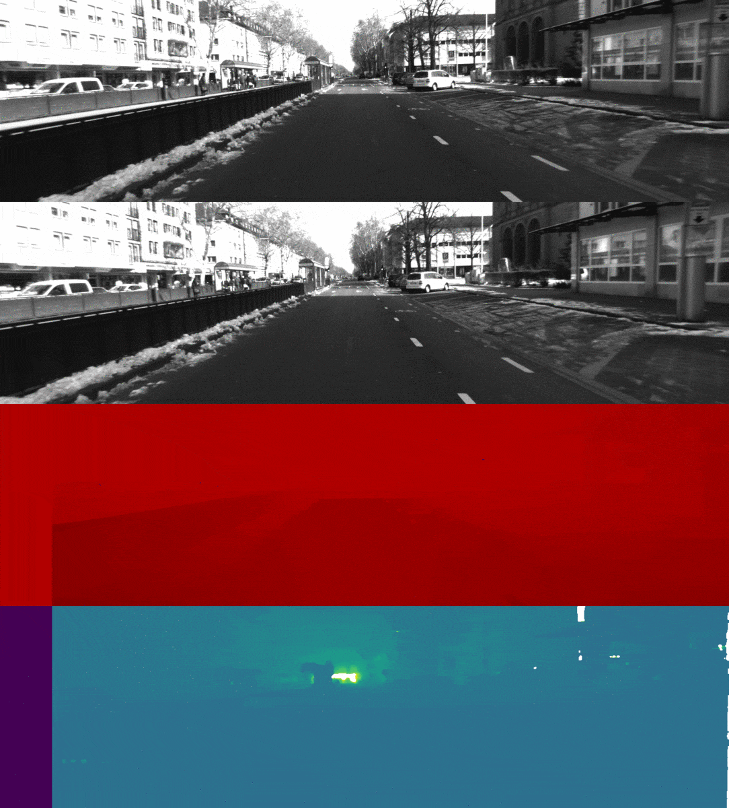

# Stereo Vision

In this project, stereo camera data is used to extract the depth information from the scene

In the below GIF, right, left , right disparity, right depth are listed from up to down. The darker the closer.

